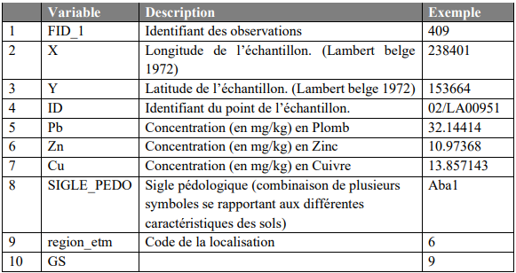
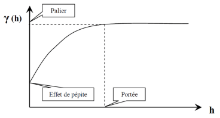

  
```{r setup, include=FALSE}
rm(list=ls()) # Clean the workspace
library(data.table)
library(ggplot2)
library(gridExtra)
library(PerformanceAnalytics)
library(car)
library(rgl)
library(gstat)
library(latticeExtra)
library(AID)
library(rgdal)
library(raster)
library(broom)
library(RColorBrewer)
library(rgeos)
library(dplyr)
library(sf)
library(pander)
```

# Méthodologie

Les traitements statistiques ont été réalisés avec le logiciel R (version 4.1.1). Par ailleurs, les opérations géostatistiques ont été réalisées à l’aide du package ‘gstat’ disponible sur R. Les transformations Box-Cox sont réalisée à l’aide de la librairie ‘AID’. Les graphes ont quant à été générés avec l’extension ‘ggplot’.

# Traitement des données

Les données utilisées ont été récoltées par plusieurs laboratoires en Wallonie.
Le set que nous utilisons est un extrait de ce large jeu de données comprenant les concentrations trois éléments traces métalliques (ETM) pour une province Wallonne.  
Plus précisément, il s’agit de concentrations en Plomb, Zinc et Cuivre récoltés à de multiples sites d'échantillonnage contenue dans la province de Liège.

```{r, echo=TRUE}
mydata <- fread('data.csv')
summary(mydata)
head(mydata)
```

Le jeu de données contient 10 variables à savoir : un identifiant, des coordonnées (latitude et longitude), 3 éléments traces métalliques et 3 autres variables dont SIGLE-PEDO qui informe sur le type de sol.



## Carte de la position des points de mesures des ETM et limite de la province étudiée.

```{r, echo=TRUE}
# Create grid (using a margin to make sure you englobe the whole province)
gridsize = 1000
margin = 5000
x <- seq(floor(min(mydata$X)-margin), # from minimum longitude
         ceiling(max(mydata$X+margin)), # to maximum longitude
         by=gridsize)
y <- seq(floor(min(mydata$Y)-margin), # from minimum latitude
         ceiling(max(mydata$Y)+margin), # to maximum latitude
         by=gridsize)
grid <- as.data.table(expand.grid(X=x, Y=y)) 

# Create a spatial version of your grid
mydataSpatial <- copy(grid)
coordinates(mydataSpatial) <- ~X+Y
proj4string(mydataSpatial) <- CRS("+init=epsg:31370") # Specify coordinate system (Lambert belge 1972)
```

```{r, echo=TRUE}
# Load provinces shapefile and specify it's coordinate system
prov <- readOGR('BEL_ADM2.shp', use_iconv = TRUE, encoding = "UTF-8")
prov <- spTransform(prov, CRS("+init=epsg:31370"))
plot(prov) # Display provinces
prov$NAME_2
# Transform grid coordinates system to match provinces
mydataSpatial <- spTransform(mydataSpatial, CRS("+init=epsg:31370"))
# Get index of points in the province of Liège
prov.id <- over(prov[prov$NAME_2 == "Liège", ],
               mydataSpatial, 
               returnList = TRUE)

# Select rows in your original grid that are located in Liège
prov.grid = grid[prov.id[[1]],]
```

```{r, echo=TRUE}
# Display selected grid points in red and data location
ggplot()+
  geom_point(data=prov.grid, aes(x=X, y=Y), color='black', shape = 3)+
  geom_point(data=grid, aes(x=X, y=Y), color='black', shape = 3) +
 geom_point(data=prov.grid, aes(x=X, y=Y), color='red', shape = 3)+
 geom_point(data=mydata,aes(x=X,y=Y,shape="Point de mesure"),color="black")+
 ggtitle("Limite de la province étudiée (Liège) et positions des points de mesures")+
 xlab("Longitude (Lambert belge 1972)")+
 ylab("Latitude (Lambert belge 1972)")+
 scale_shape_manual("",values=15)
```

## Nettoyage et visualisation des échantillons par ETM

### Pb sample

```{r, echo=TRUE}
Pb <- na.omit(subset(mydata,select=c("X","Y","Pb")))

ggplot() +
  geom_point(data=Pb, aes(x=X, y=Y, color=Pb), size=2) +
  scale_color_gradient(low='blue',high ='yellow')+
  xlab("Longitude") +
  ylab("Latitude") +
  ggtitle("Sample Pb")
```

### Zn sample

```{r, echo=TRUE}
Zn <- na.omit(subset(mydata,select=c("X","Y","Zn")))

#Plot

ggplot() +
  geom_point(data=Zn, aes(x=X, y=Y, color=Zn), size=2) +
  scale_color_gradient(low='blue',high ='yellow')+
  xlab("Longitude") +
  ylab("Latitude") +
  ggtitle("Sample Zn")
```

### Cu sample

```{r, echo=TRUE}
Cu <- na.omit(subset(mydata,select=c("X","Y","Cu")))

#Plot

ggplot() +
  geom_point(data=Cu, aes(x=X, y=Y, color=Cu), size=2) +
  scale_color_gradient(low='blue',high ='yellow')+
  xlab("Longitude") +
  ylab("Latitude") +
  ggtitle("Sample Cu")
```

## Analyse exploratoire des données

Le jeu de données des ETM ayant été l’objet d’un premier traitement, les statistiques de bases ont été calculées. 

```{r, echo=TRUE}
mydata %>%
  select(Pb, Zn, Cu) %>%
  summary %>%
  pander()
```

```{r, echo=TRUE}
chart.Correlation(mydata[,.(Zn,Pb,Cu)]) 
```

Etant donné que les distributions observées des ETM ne s'apparente pas à des lois normales, il est nécessaire d'appliquer une transformation à chacune des trois distributions pour pouvoir utilisé les modèles.  

Une forte corrélation, soit la meilleure, entre le plomb et le zinc est observée, avec un coefficient de l’ordre de 0.73. Le Zinc est presqu’aussi bien corrélé au cuivre avec un coefficient de 0.73. Enfin, la corrélation entre le plomb et le cuivre est la plus faible, soit un coefficient de 0.59

## Correction de la distribution

Il est nécessaire, pour satisfaire aux hypothèses des modèles uitilisé pour les analyses et prédictions d’avoir des données suivant une distribution normale.
La transformation Box-Cox a été utilisée afin de corriger la distribution des ETM lorsque celle-ci ne fut pas similaire à une distribution normale.

Pour une variable Z à valeurs non négatives, la transformée de Box-Cox est définit de la
manière suivante :

$$Y_i = \begin{cases}
        \frac{Z^{\theta}_{i}-1}{\theta}, & \text{si } \theta \neq 0 \\
        ln(Z_{i}), & \text{si } \theta = 0
        \end{cases}$$

Le paramètre θ est alors choisi pour que la variable transformée Yi s’approche au mieux d’une distribution normale.

### Box-cox sur la distribution des échantillons de Plomb

```{r, echo=TRUE}
# Plomb
BPb <- boxcoxnc(Pb$Pb, verbose = FALSE)
Pb$Pbbx <- BPb$tf.data
```

### Box-cox sur la distribution des échantillons de Zinc

```{r, echo=TRUE}
BZn <- boxcoxnc(Zn$Zn, verbose = FALSE)
Zn$Znbx <- BZn$tf.data
```

### Box-cox sur la distribution des échantillons de Cuivre

```{r, echo=TRUE}
BCu <- boxcoxnc(Cu$Cu, verbose = FALSE)
Cu$Cubx <- BCu$tf.data
```

# Analyse et modélisation de la dépendence spatiale

Afin de mesurer et modéliser la dépendance spatiale qu’il pourrait y avoir entre les valeurs d’un ETM, la fonction espérance et le variogramme sont utilisés.
La fonction espérance permet dans un premier temps de rendre compte de la présence ou non de stationnarité d’ordre 1. 
Dans la négative, l’espérance est donc fonction des coordonnées et le paramètre β alors être estimé à l’aide d’un modèle de régression linéaire (OLS, WLS et
GLS).
Le variogramme estime la dépendance dans l’espace en mesurant la dissimilitude des données en fonction de la distance h, avec :

$$ \gamma(h)= \frac{1}{2} Var[Z(x+h) - Z(x)] \quad \forall x \in D
  $$
Où
- Z est la variable spatiale étudiée
- x est un vecteur de coordonnées
- h est le vecteur de distance
- D est le domaine géographique considéré

On part de l'hypothèse (courramment faite) : hmax < \frac{max||h||}{2}

La figure ci-dessous illustre le variogramme et les paramètres qu'il comporte.



## Espérances et variogramme Plomb (Pb)

### Espérence du Plomb B-C

```{r, echo=TRUE}
Pbbx.lm <- lm(Pbbx~X+Y,data=Pb)
scatter3d(x=Pb$X,z=Pb$Y,y=Pb$Pbbx,
          xlab = 'Longitude', zlab = 'Lattitude', ylab = 'Pbbx')
rglwidget(width = 300, height = 300)
```

Non stationnaire d’ordre 1 + on voit des outliers

### Suppression de la tendance et outlier

```{r, echo=TRUE}
# Suppression tendance
Pb$Pbbx_res <- Pb$Pbbx-(predict(Pbbx.lm,Pb))
scatter3d(x=Pb$X,z=Pb$Y,y=Pb$Pbbx_res,
          xlab='Longitude',zlab='Latitude',ylab='Pbbx_res')
rglwidget(width = 300,height = 300)
# Détection potentiel Outlier
res.Sd <- sd(Pb$Pbbx_res)
res.Mean <- mean(Pb$Pbbx_res)
out <- nrow(Pb) - nrow(Pb[Pbbx_res %between% c(res.Mean-3*res.Sd,res.Mean+3*res.Sd),])
cat("nombre d'outlier potentiel =", out)
# Suppression outlier
Pb <- Pb[Pbbx_res %between% c(res.Mean-3*res.Sd,res.Mean+3*res.Sd),]
```

### Variogramme résidu du Plomb Bx

```{r, echo=TRUE}
Pb.gstat <- gstat(formula=Pbbx_res~1, data=Pb,locations = ~X+Y)
Pb.vario <- variogram(Pb.gstat,cutoff=40000,width=3000)
vg.exp <- vgm(model = 'Sph',nugget = 2e-4)
fit.Pb <- fit.variogram(Pb.vario, model = vg.exp,fit.method = 6)
plot(Pb.vario,model=fit.Pb, main="Variogram résidus du Plomb Bx",pch=16,col='black')
trellis.focus('panel',1,1)
llines(x=c(0,max(Pb.vario$dist)),y=c(var(Pb$Pbbx_res)),col = 'red',lty=2)
trellis.unfocus()
pander(fit.Pb)
```

## Espérances et variogramme Zinc (Zn)

### Espérence du Zinc

```{r, echo=TRUE}
Znbx.lm <- lm(Znbx~X+Y,data=Zn)
scatter3d(x=Zn$X,z=Zn$Y,y=Zn$Znbx,
          xlab = 'Longitude', zlab = 'Lattitude', ylab = 'Znbx')
rglwidget(width = 300, height = 300)
```

Non stationnaire d’ordre 1 + on voit des outliers

### Suppression de la tendance et outlier

```{r, echo=TRUE}
# Suppressions tendance
Zn$Znbx_res <- Zn$Znbx-(predict(Znbx.lm,Zn))
scatter3d(x=Zn$X,z=Zn$Y,y=Zn$Znbx_res,
          xlab='Longitude',zlab='Latitude',ylab='Znbx_res')
rglwidget(width = 300,height = 300)
# Détection potentiel Outlier
res.Sd <- sd(Zn$Znbx_res)
res.Mean <- mean(Zn$Znbx_res)
out <- nrow(Zn) - nrow(Zn[Znbx_res %between% c(res.Mean-3*res.Sd,res.Mean+3*res.Sd),])
cat("nombre d'outlier potentiel =", out)
# Suppression outlier
Zn <- Zn[Znbx_res %between% c(res.Mean-3*res.Sd,res.Mean+3*res.Sd),]
```

### Variogramme résidu du Zinc Bx

```{r, echo=TRUE}
Zn.gstat <- gstat(formula=Znbx_res~1, data=Zn,locations = ~X+Y)
Zn.vario <- variogram(Zn.gstat,cutoff=40000,width=3000)

vg.exp <- vgm(model = 'Sph',nugget = 0.002)
fit.Zn <- fit.variogram(Zn.vario, model = vg.exp,fit.method = 6)
plot(Zn.vario,model=fit.Zn ,main="Variogram résidus du Zinc",pch=16,col='black')

trellis.focus('panel',1,1)
llines(x=c(0,max(Zn.vario$dist)),y=c(var(Zn$Znbx_res)),col = 'red',lty = 2)
trellis.unfocus()
pander(fit.Zn)
```

## Espérances et variogramme Cuivre (Cu)

### Espérence du Cuivre

```{r, echo=TRUE}
Cubx.lm <- lm(Cubx~X+Y,data=Cu)
scatter3d(x=Cu$X,z=Cu$Y,y=Cu$Cubx,
          xlab = 'Longitude', zlab = 'Lattitude', ylab = 'Cubx')
rglwidget(width = 300, height = 300)
```

Non stationnaire d’ordre 1 + on voit des outliers

### Suppression de la tendance et outlier

```{r, echo=TRUE}
# Suppressions tendance
Cu$Cubx_res <- Cu$Cubx-(predict(Cubx.lm,Cu))
scatter3d(x=Cu$X,z=Cu$Y,y=Cu$Cubx_res,
          xlab='Longitude',zlab='Latitude',ylab='Cubx')
rglwidget(width = 300,height = 300)
# Détection potentiel Outlier
res.Sd <- sd(Cu$Cubx_res)
res.Mean <- mean(Cu$Cubx_res)
out <- nrow(Cu) - nrow(Cu[Cubx_res %between% c(res.Mean-3*res.Sd,res.Mean+3*res.Sd),])
cat("nombre d'outlier potentiel =", out)
# Suppression outlier
Cu <- Cu[Cubx_res %between% c(res.Mean-3*res.Sd,res.Mean+3*res.Sd),]
```

### Variogramme résidu du Cuivre Bx

```{r, echo=TRUE}
Cu.gstat <- gstat(formula=Cubx_res~1, data=Cu,locations = ~X+Y)
Cu.vario <- variogram(Cu.gstat,cutoff=40000,width=3000)

vg.exp <- vgm(model = 'Sph',nugget = 0.01)
fit.Cu <- fit.variogram(Cu.vario, model = vg.exp,fit.method = 6)
plot(Cu.vario,model=fit.Cu, main="Variogram résidus du Cuivre",pch=16,col='black')
trellis.focus('panel',1,1)
llines(x=c(0,max(Cu.vario$dist)),y=c(var(Cu$Cubx_res)),col = 'red',lty=2)
trellis.unfocus()
pander(fit.Cu)
```

# Prédiction des ETM

Demande normalité, stationnarité d’ordre 1 et 2

```{r, echo=TRUE}
plot.predictions <- function(pred,data, plot.title,legend){
  ggplot() + 
  geom_tile(data=pred, 
            aes(x = X, y = Y, fill = predi)) +
  geom_point(data=data, 
             aes(x=X, y=Y, color="Measurement points"),
             shape=18,
             size=2) +
  scale_color_manual("", values="black") +
  scale_fill_gradientn(name=legend, colors=c('royalblue','green3', 'yellow', 'red')) +
  theme(legend.key = element_rect(fill = "green3", 
                                  color = NA)) +
  xlab("Longitude") +
  ylab("Latitude") +
  ggtitle(plot.title)
}
```

## Prédiction par la méthode de distance inverse

La prédiction par distance inverse (Inverse distance weighting [IDW]) est un prédicteur exact qui possède l’avantage de prendre en compte la distance entre le point prédit et les échantillons.
On attribue ainsi à chaque points xi poids qui est proportionnel à l’inverse de la distance entre ce point et x0 ou l’on réalise la prédiction.
Formellement, ce poids est donné par :

$$\lambda_{i} = \frac{\frac{1}{||h_{0i}||^{\theta}}}{\sum^{n}_{j=1}\frac{1}{||h_{0j}||^{\theta}}} \quad avec : \theta > 0$$
Le paramètre θ détermine donc la vitesse de diminution du poids d’un point en fonction de la distance ||h||.
Ce paramètre est optimisé en minimisant la somme du carré des écarts lors de la leave-one-out cross validation (LOOCV).

### Plomb

#### Optimisation de θ par LOOCV

```{r, echo=TRUE}
powers <- seq(0.5,5,0.5)
pmse <- data.table(power = powers, mse = rep(0,length(powers)) )# Power mean squared error
for (p in powers){
  pse <- rep(0,nrow(Pb)) # Power squared errors
  for (i in 1:nrow(Pb)){
     point.idw <- idw(formula = Pbbx~1,
              data = Pb[-i,],
              locations = ~X+Y,
              newdata = Pb[i,],
              idp = p,
              nmax=20,
              maxdist=30000,
              debug.level = 0)
     pse[i] <- (point.idw$var1.pred - Pb$Pbbx[i])^2
  }
  pmse[power==p,"mse"] = mean(pse)
}

plot(pmse)
```

#### Plot résultat IDW Plomb

```{r, echo=TRUE}
#Plot résultat
Pb.idw <- data.table(idw(formula = Pbbx~1,data=Pb,location=~X+Y,newdata=prov.grid,idp=1.5,nmax=20))
setnames(Pb.idw,"var1.pred","predBx")

#Transfo inverse
alpha = BPb$lambda.hat
Pb.idw[,predi := exp(log(alpha * predBx + 1) / alpha)]

plot.predictions(Pb.idw,Pb,"Concentration en plomb - Prediction Distance inverse","Pb predictions")
```

### Zinc

#### Optimisation de θ par LOOCV
 
```{r, echo=TRUE}
powers <- seq(0.5,5,0.5)
pmse <- data.table(power = powers, mse = rep(0,length(powers)) )# Power mean squared error
for (p in powers){
  pse <- rep(0,nrow(Zn)) # Power squared errors
  for (i in 1:nrow(Zn)){
     point.idw <- idw(formula = Znbx~1,
              data = Zn[-i,],
              locations = ~X+Y,
              newdata = Zn[i,],
              idp = p,
              nmax=20,
              maxdist=30000,
              debug.level = 0)
     pse[i] <- (point.idw$var1.pred - Zn$Znbx[i])^2
  }
  pmse[power==p,"mse"] = mean(pse)
}

plot(pmse)
```

#### Plot résultat IDW Zinc

```{r, echo=TRUE}
Zn.idw <- data.table(idw(formula = Znbx~1,data=Zn,location=~X+Y,newdata=prov.grid,idp=1,nmax=20,maxdist=30000))
setnames(Zn.idw,"var1.pred","predBx")

# Transformation inverse
alpha = BZn$lambda.hat
Zn.idw[,predi := exp(log(alpha * predBx + 1) / alpha)]

plot.predictions(Zn.idw,Zn,"Concentration en Zinc - Prediction Distance inverse","Zn predictions")
```

### Cuivre

#### Optimisation de θ par LOOCV

```{r, echo=TRUE}
powers <- seq(0.4,2,0.2)
pmse <- data.table(power = powers, mse = rep(0,length(powers)) )# Power mean squared error
for (p in powers){
  pse <- rep(0,nrow(Cu)) # Power squared errors
  for (i in 1:nrow(Cu)){
     point.idw <- idw(formula = Cubx~1,
              data = Cu[-i,],
              locations = ~X+Y,
              newdata = Cu[i,],
              idp = p,
              nmax=20,
              maxdist=30000,
              debug.level = 0)
     pse[i] <- (point.idw$var1.pred - Cu$Cubx[i])^2
  }
  pmse[power==p,"mse"] = mean(pse)
}

plot(pmse)
```

#### Plot résultat IDW Cuivre

```{r, echo=TRUE}
Cu.idw <- data.table(idw(formula = Cubx~1,data=Cu,location=~X+Y,newdata=prov.grid,idp=1.25,nmax=20,maxdist=30000))
setnames(Cu.idw,"var1.pred","predBx")

# Transformation inverse
alpha = BCu$lambda.hat
Cu.idw[,predi := exp(log(alpha * predBx + 1) / alpha)]

plot.predictions(Cu.idw,Cu,"Concentration en Cuivre - Prediction Distance inverse","Cu predictions")
```

## Via le krigeage

Le Krigeage ou BLUP (Best Linear Unbiased Predictor) est une technique géostatistique de modélisation spatiale qui présente l’avantage de prendre en compte les distances entre les données et le point estimé et la structure spatiale (grâce au variogramme). 
Ainsi, le krigeage se base sur une hypothèse d’autocorrélation spatiale des données en posant que deux données proches dans l’espace possèdent des caractéristiques similaires. 
Le krigeage a basiquement un modèle similaire à la régression linéaire mais les erreurs y sont supposées dépendantes spatialement :

$$Z(x) = \mu(x) + \delta(x) \quad \forall x \in D$$
Où :
- \mu est l'espérance de Z
- \delta est une fonction aléatoire stationnaire

### Plomb

```{r, echo=TRUE}
doublons <- which(duplicated(Pb$X,Pb$Y))
Pb2<-Pb[-doublons,]
Pb.krig <- data.table(krige(formula = Pbbx_res~1, data = Pb2,locations = ~X+Y,
                            newdata = prov.grid, model = fit.Pb))
setnames(Pb.krig, c("var1.pred", "var1.var"), c("pred", "Pb.varkrig"))
Pb.krig$pred <- Pb.krig$pred+predict(Pbbx.lm,Pb.krig)
alpha <- BPb$lambda.hat
Pb.krig[,predi := exp(log(alpha * pred + 1) / alpha)]

plot.predictions(Pb.krig,Pb,"Concentration en Plomb - Krigeage","Pb prediction")
```

### Zinc

```{r, echo=TRUE}
doublons <- which(duplicated(Zn$X,Zn$Y))
Zn2<-Zn[-doublons,]
Zn.krig <- data.table(krige(formula = Znbx_res~1, data = Zn2,locations = ~X+Y,
                            newdata = prov.grid, model = fit.Zn))
setnames(Zn.krig, c("var1.pred", "var1.var"), c("pred", "Zn.varkrig"))
Zn.krig$pred <- Zn.krig$pred+predict(Znbx.lm,Zn.krig)
alpha <- BZn$lambda.hat
Zn.krig[,predi := exp(log(alpha * pred + 1) / alpha)]
plot.predictions(Zn.krig,Zn,"Concentration en Zinc - Krigeage","Zn predictions")
```

### Cuivre

```{r, echo=TRUE}
doublons <- which(duplicated(Cu$X,Cu$Y))
Cu2<-Cu[-doublons,]

Cu.krig <- data.table(krige(formula = Cubx_res~1, data = Cu2,locations = ~X+Y,
                            newdata = prov.grid, model = fit.Cu,nmax=1))
setnames(Cu.krig, c("var1.pred", "var1.var"), c("pred", "Cu.varkrig"))
Cu.krig$pred <- Cu.krig$pred+predict(Cubx.lm,Cu.krig)
alpha <- BCu$lambda.hat
Cu.krig[,predi := exp(log(alpha * pred + 1) / alpha)]
plot.predictions(Cu.krig,Cu,"Concentration en Cuivre - Krigeage","Cu predictions")
```

## Via cokrigeage de Pb avec Zn

Dans le cas ou deux champs aléatoires sont corrélés, le krigeage peut être précisé en combinant ces deux échantillons. La démarche est alors similaire à celle du Krigeage défini ci-dessus mais prend alors en compte une seconde variable pour la prédiction désirée. L’amélioration de la prédiction est d’autant plus importante lorsque :
- Les variables sont fortement corrélées ;
- La taille de la seconde variable est grande (par rapport à celle qu’on veut prédire) ;
- Les positions échantillonnées de la seconde variable varient de ceux de la première.


```{r, echo=TRUE}
g <- gstat(id="Pb", formula=Pbbx~1, data=Pb2, locations= ~X+Y)
g <- gstat(g,id='Zn',formula = Znbx~1, data = Zn2, locations = ~X+Y)
v.cross <- variogram(g, cutoff=40000, width=3000)
plot(v.cross)

LMC <- fit.lmc(v.cross,g,model = fit.Pb, correct.diagonal = 1.1,fit.method=6)
LMC

g <- copy(LMC)
g <- gstat(g, id='Zn', formula = Znbx~1,data = Zn2,locations = ~X+Y,model = LMC$model$Zn)
plot(v.cross,model=g$model,col='black',pch=16)
```


```{r, echo=TRUE}
Pb.cok <- data.table(predict(g,prov.grid))
setnames(Pb.cok, c('Pb.pred','Pb.var'),c('pred','Pb.varcok'))
#Pb.cok$pred <- Pb.cok$pred+predict(Pbbx.lm,Pb.cok)
alpha <- BPb$lambda.hat
Pb.cok[,predi := exp(log(alpha * pred + 1) / alpha)]
plot.predictions(Pb.cok,Pb,'Concentration en Plomb - Cokrigeage','Prediction')
```

## Simulation conditionnelles du plomb

Dans le cas d’une simulation conditionnelle, on dispose et prend en compte les valeurs connues des échantillons.
Les simulations sont alors basées sur le variogramme γ(||h||) et conditionnées par les concentrations connues par échantillonnages. 
En réalisant plusieurs de ces simulations pour le Plomb, il sera possible de définir les zones possiblement contaminée dont la concentration dépasse un seuil fixé.
Les zones qui dépassent ce seuil dans plus de x pourcent des simulations peuvent alors être suspectées d’être contaminées.

```{r, echo=TRUE}

```


```{r, echo=TRUE}

```